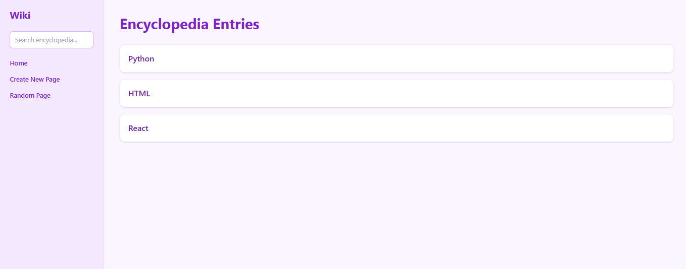
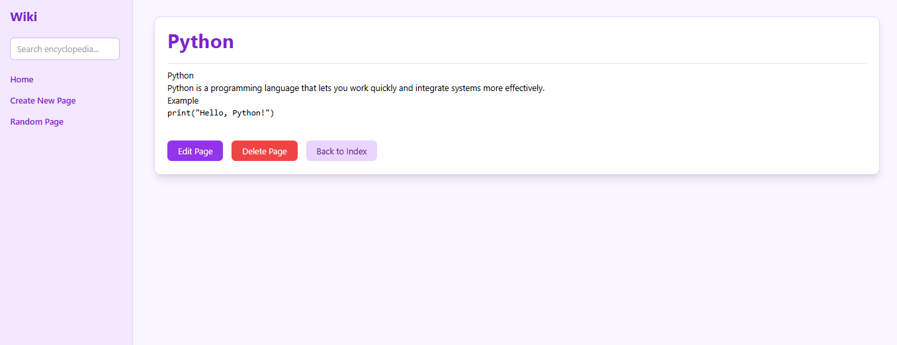
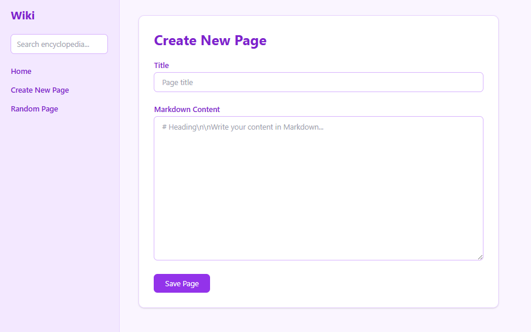
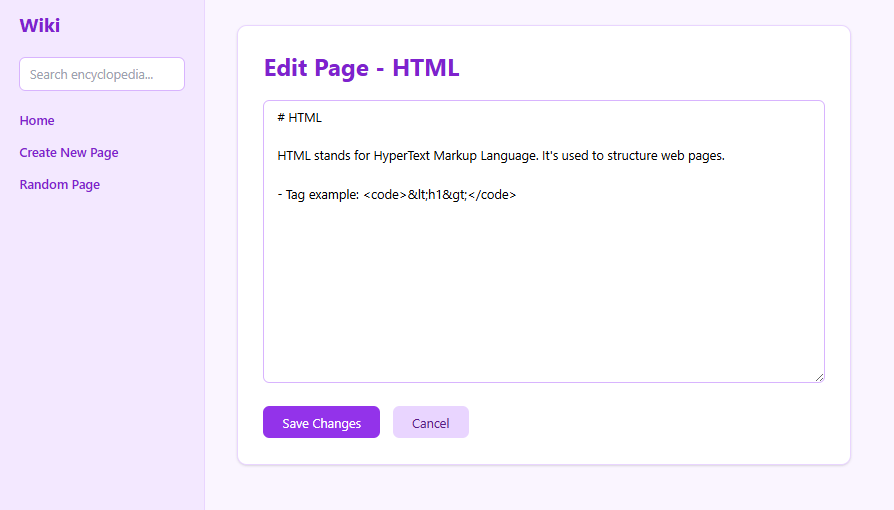

# Wiki

## Project Functionality
- View encyclopedia entries (`/wiki/:title`)
- List all entries on the index page
- Sidebar navigation (Home, Search, New Page, Random Page)
- Search entries
  - Exact match → redirects to entry
  - Substring match → shows results list
- Create new entries with Markdown content
- Edit existing entries
- Delete entries
- Open a random entry
- Markdown content rendered as HTML

---

## Tech Stack
- Frontend: React, Tailwind CSS (CDN), Axios, React Router
- Backend: Node.js, Express.js
- Database: MongoDB (local) with Mongoose

---

## How to Run the Project

---

### 1. Backend Setup
```bash
cd backend
npm install
npm run dev
````

---

### 2. .env Setup
 
Create .env file in your backend folder like this
```bash
MONGO_URI=your_mongo_uri
PORT=5000
````

---

### 3. Frontend Setup

```bash
cd frontend
npm install
npm run dev
```

---

### 4. Access App

* Frontend: `http://localhost:5173`
* Backend API: `http://localhost:5000/api/entries`

---

## Screenshots

### Home Page


### Entry Page


### New Page


### Edit Page
